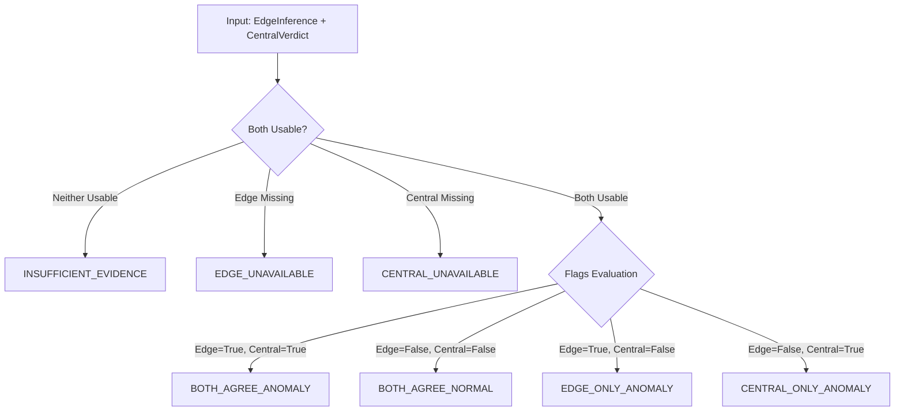

# SkyGuard AI — Edge Result ↔ Central AI Comparison Layer

**Status:** Step 5 Complete  
**Module:** [`model/edge_central_comparison.py`](file:///d:/sky/LULLABY-SKYGUARD-main/model/edge_central_comparison.py)  
**Data Contract:** [`EdgeCentralComparison` in `model/contracts.py`](file:///d:/sky/LULLABY-SKYGUARD-main/model/contracts.py#L229-L288)

---

## 1. Why Edge-Central Comparison Exists

In SkyGuard AI's two-level hybrid architecture, edge microcontrollers (ESP32) and the central cloud backend analyze sensor data from distinct vantage points:
- **Level 1 (Edge / ESP32):** Operates on localized, instantaneous observation vectors using zero-overhead floating-point physical range rules, dropout detection, and basic sensor failure criteria.
- **Level 2 (Central AI / Backend):** Operates on rich multi-hour rolling historical windows, spatial peer-station corroboration, Isolation Forest machine learning, CUSUM/EWMA statistical trackers, physical consistency checks, and SHAP explainability.

The **Edge ↔ Central Comparison Layer** establishes an explicit, auditable bridge between these two independent inference stages. It enables the system to continuously evaluate:
1. *What did the edge device diagnose?*
2. *What did the central AI conclude?*
3. *Did both layers achieve consensus or diverge?*
4. *If they diverged, what failure mode or edge-case occurred?*

> [!IMPORTANT]
> The comparison layer is strictly **diagnostic and analytical** at this stage. It does **NOT** replace central AI, nor does it impose a final decision policy that would override either level's independent detection.

---

## 2. Edge Result vs. Central Result

| Property | Level 1: Edge Inference (`EdgeInference`) | Level 2: Central AI (`CentralVerdict`) |
|---|---|---|
| **Execution Environment** | ESP32 Xtensa LX6/LX7 Microcontroller | Python 3.14 Backend Service |
| **Input Scope** | Instantaneous single-packet sensor vector | 72-hour historical buffer + spatial network neighbors |
| **Algorithms** | `physical_bounds`, `dropout`, `sensor_fail_low` | Isolation Forest, CUSUM, EWMA, Physics Rules, Spatial Corroboration, SHAP |
| **Anomaly Decision** | `anomaly_flag: bool` | `is_anomaly: bool` |
| **Fault Diagnosis** | `anomaly_type: Optional[str]` | `fault_type: Optional[str]` |
| **Quantitative Metric** | `score: Optional[float]` (heuristic / raw) | `anomaly_score_pct: float` (0.0% to 100.0%) |
| **Confidence Scale** | Heuristic / arbitrary | `model_confidence_pct`, `rule_confidence_pct` |

---

## 3. Standardized Comparison Statuses

The comparison component evaluates verdicts into seven standardized, mutually exclusive statuses:



1. **`BOTH_AGREE_ANOMALY`**: Both Edge device and Central AI independently flagged an anomaly (`edge_flag == True` and `central_flag == True`).
2. **`BOTH_AGREE_NORMAL`**: Both Edge device and Central AI agreed the observation is normal (`edge_flag == False` and `central_flag == False`).
3. **`EDGE_ONLY_ANOMALY`**: Edge device flagged an anomaly, but Central AI scored the reading as normal (`edge_flag == True` and `central_flag == False`).
4. **`CENTRAL_ONLY_ANOMALY`**: Central AI flagged an anomaly (e.g. subtle multi-hour drift or temporal spike), but Edge device classified it as normal (`edge_flag == False` and `central_flag == True`).
5. **`EDGE_UNAVAILABLE`**: Observation packet lacked usable edge inference metadata (`edge_inference` was missing or marked `unavailable`). Central AI evaluated the observation independently.
6. **`CENTRAL_UNAVAILABLE`**: Central AI detection could not produce a verdict. Edge inference was preserved independently.
7. **`INSUFFICIENT_EVIDENCE`**: Neither edge inference nor central detection was available in a format that could be evaluated.

---

## 4. Agreement and Disagreement Semantics

### Boolean Anomaly Decision Agreement (`anomaly_decision_agreement`)
- Set to `True` when both sources agree on normality or anomaly (`BOTH_AGREE_NORMAL` or `BOTH_AGREE_ANOMALY`).
- Set to `False` when one source flags an anomaly and the other does not (`EDGE_ONLY_ANOMALY` or `CENTRAL_ONLY_ANOMALY`).
- Set to `None` when either edge or central results are unavailable (`EDGE_UNAVAILABLE`, `CENTRAL_UNAVAILABLE`, `INSUFFICIENT_EVIDENCE`).

### Fault Type Alignment (`type_agreement`)
- Distinct from boolean decision agreement.
- When `BOTH_AGREE_ANOMALY` occurs:
  - If both report identical fault types (case-insensitive string match, e.g. `physical_bounds` == `physical_bounds`), `type_agreement = True`.
  - If fault types differ (e.g. edge reported `physical_bounds` while central AI diagnosed `drift`), `type_agreement = False`.
- When either or both indicate normal operation, `type_agreement = None`.

---

## 5. Missing Data & Availability Handling

### Missing Edge Inference (`EDGE_UNAVAILABLE`)
- When edge firmware is disabled, unmetered, or transmitting legacy packets without edge metadata, the central pipeline processes the raw readings without failure.
- Comparison reports `EDGE_UNAVAILABLE` and documents that central detection proceeded independently.

### Missing Central Result (`CENTRAL_UNAVAILABLE`)
- If central detection is bypassed or fails, the edge inference is preserved without manufacturing a fake central verdict.
- Comparison reports `CENTRAL_UNAVAILABLE`.

---

## 6. Score Comparison Limitations

- **No Blind Numerical Differences**: Edge heuristic scores (e.g., raw sensor bounds distances or rule scores) and Central AI anomaly percentages (calibrated 0–100% probabilities from ML fusion) operate on completely different mathematical scales and semantics.
- **Independent Preservation**: `EdgeCentralComparison` preserves `edge_score`, `edge_score_type`, `central_score`, and `central_score_type` independently. No artificial normalization, scaling, or subtracted `score_difference` is computed.

---

## 7. Why No Final AND/OR Decision Policy is Implemented

Implementing a hardcoded rule such as `final_anomaly = edge_anomaly AND central_anomaly` (strict intersection) or `final_anomaly = edge_anomaly OR central_anomaly` (permissive union) would be premature:
1. **Edge-only flags** often identify ultra-fast instantaneous electrical dropouts before rolling baseline buffers see them.
2. **Central-only flags** identify subtle sensor calibration drift and frozen-sensor regimes requiring 24h history that an ESP32 cannot store.
3. Combining them via naive boolean logic would either inflate false positive rates or suppress real hardware faults.

Therefore, Step 5 provides an **auditable comparison artifact** without altering central detection authority.

---

## 8. Data Preservation Guarantees

The comparison module is a pure, deterministic, side-effect-free function:
- **Raw Readings**: Temperature, pressure, and humidity are never clamped, normalized, or modified.
- **Timestamps & IDs**: `event_id`, `station_id`, `device_id`, and `observed_at` remain identical.
- **Edge Inference**: All edge metadata fields are preserved verbatim.
- **Central Verdict**: Central anomaly scores, fault types, suggested values, and SHAP features are preserved untouched.

---

## 9. Current Integration Point

Integrated inside [`model/ingestion.py`](file:///d:/sky/LULLABY-SKYGUARD-main/model/ingestion.py#L106-L167) within `ObservationIngestionService.ingest_observation()`:

```
ObservationPacket ──> Ingestion Service
                             │
                             ▼
                    StateManager.ingest_reading()  (Independent Central AI)
                             │
                             ▼
                    compare_edge_central()        (Pure Diagnostic Evaluator)
                             │
                             ▼
               ┌─────────────┴─────────────┐
               ▼                           ▼
        Simulator State            Live WebSocket Broadcast
    (sim.latest, anomalies)        ("type": "OBSERVATION_INGESTED",
                                    "comparison": {...})
```

---

## 10. Persistence Limitations & Future Database Migration

- **Current State**: Comparison results are computed and retained in-memory within `sim.latest[station_id]["comparison"]`, `sim.recent_anomalies`, and live WebSocket event streams.
- **Persistence Gap**: The active `sensor_readings` hypertable in TimescaleDB and the local CSV mirror in `history_store.py` currently store central detection columns (`is_anomaly`, `fault_type`, `anomaly_score_pct`, etc.) without edge comparison columns.
- **Future Migration (Step 6)**: Step 6 will introduce persistent storage for:
  - `edge_status`, `edge_anomaly_flag`, `edge_anomaly_type`, `edge_score`, `edge_model_version`
  - `comparison_status`, `anomaly_decision_agreement`, `type_agreement`

---

## 11. Future Role in Sensor Health & Alert Decisions

In subsequent architecture phases (Step 6+), the comparison metadata will directly inform:
1. **Edge Rule Tuning & Drift Diagnostics**: High rates of `EDGE_ONLY_ANOMALY` indicate overly aggressive edge threshold bounds or electrical noise.
2. **Central Model Calibration**: High rates of `CENTRAL_ONLY_ANOMALY` identify drift or seasonal weather patterns that may require updated edge rule sets.
3. **Hardware Sensor Health Degradation**: Persistent `type_agreement = False` provides high-confidence diagnostic indicators of intermittent hardware transducer failure.
