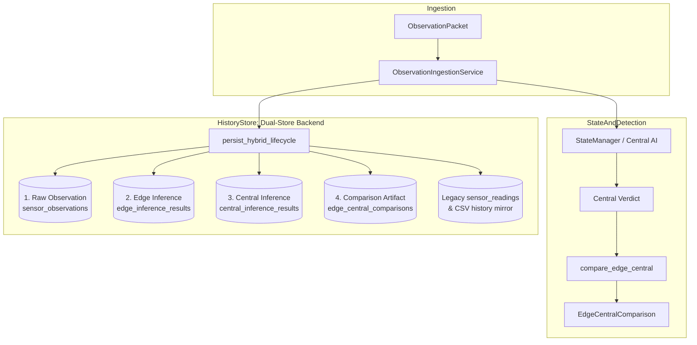

# SkyGuard AI — Hybrid Observation Lifecycle Persistence

**Status:** Step 6 Complete  
**Module:** [`history_store.py`](file:///d:/sky/LULLABY-SKYGUARD-main/history_store.py)  
**Ingestion Integration:** [`model/ingestion.py`](file:///d:/sky/LULLABY-SKYGUARD-main/model/ingestion.py)  
**Data Contracts:** [`model/contracts.py`](file:///d:/sky/LULLABY-SKYGUARD-main/model/contracts.py)  
**Test Suite:** [`tests/test_hybrid_persistence.py`](file:///d:/sky/LULLABY-SKYGUARD-main/tests/test_hybrid_persistence.py)

---

## 1. Executive Summary & Architecture Overview

SkyGuard AI operates a two-level anomaly detection architecture:
- **Level 1 (Edge / ESP32):** Instantaneous microcontroller-side lightweight rule evaluation.
- **Level 2 (Central AI / Backend):** Multi-hour historical baseline rolling windows, Isolation Forest machine learning, CUSUM/EWMA statistical trackers, spatial corroboration, and SHAP explainability.
- **Diagnostic Comparison Layer:** An explicit consensus and divergence audit trail.

**Step 6 establishes durable, independent, and immutable persistence for the four distinct layers of the observation lifecycle:**



> [!IMPORTANT]
> **Key Architectural Guarantees:**
> 1. **Raw Sensor Observations are Authoritative Historical Inputs:** Sensor readings (`temperature_c`, `pressure_hpa`, `humidity_pct`) are stored verbatim without destructive filtering, clamping, zero-filling, or imputation.
> 2. **Edge and Central Inferences are Separate Results:** Level 1 and Level 2 verdicts are persisted independently and can never overwrite each other.
> 3. **Comparison is Diagnostic Metadata:** The comparison artifact documents consensus or divergence for auditability. It does NOT replace Central AI authority, and NO artificial boolean AND/OR decision policy is applied.

---

## 2. Existing `sensor_readings` Storage & Backward Compatibility

The system maintains its dual-store design for all legacy endpoints (`/api/trends`, `/api/current-reading`, `/api/sensor-health`):
1. **TimescaleDB / PostgreSQL Hypertable (`sensor_readings`):** Stores timestamped station metrics with central anomaly scores and health states.
2. **Local Station CSVs (`data/history/{station_id}_history.csv`):** Mirrors central reading history matching `HISTORY_COLUMNS` to ensure 100% offline resilience.

Existing callers and dashboard components continue to read from these stores without any breaking schema changes.

---

## 3. Four-Layer Hybrid Data Model

The persistence layer separates each stage of the observation lifecycle into distinct structured entities correlated by `event_id`:

```
┌─────────────────────────────────────────────────────────────────────────────┐
│ 1. SENSOR OBSERVATION (sensor_observations / {station_id}_hybrid.csv)       │
├─────────────────────────────────────────────────────────────────────────────┤
│ event_id, station_id, device_id, observed_at, sequence_number,              │
│ temperature_c, pressure_hpa, humidity_pct,                                  │
│ firmware_version, battery_voltage, signal_strength                          │
└─────────────────────────────────────────────────────────────────────────────┘
                                       │
                                       ▼ correlated by event_id
┌─────────────────────────────────────────────────────────────────────────────┐
│ 2. EDGE INFERENCE (edge_inference_results)                                  │
├─────────────────────────────────────────────────────────────────────────────┤
│ event_id, station_id, device_id, observed_at,                               │
│ status, anomaly_flag, anomaly_type, score, score_type,                      │
│ model_version, inference_method                                             │
└─────────────────────────────────────────────────────────────────────────────┘
                                       │
                                       ▼ correlated by event_id
┌─────────────────────────────────────────────────────────────────────────────┐
│ 3. CENTRAL AI INFERENCE (central_inference_results)                         │
├─────────────────────────────────────────────────────────────────────────────┤
│ event_id, station_id, observed_at,                                          │
│ is_anomaly, fault_type, severity, anomaly_score_pct,                        │
│ model_confidence_pct, rule_confidence_pct, model_status,                     │
│ decision_basis, health_status, suggested_values, source                     │
└─────────────────────────────────────────────────────────────────────────────┘
                                       │
                                       ▼ correlated by event_id
┌─────────────────────────────────────────────────────────────────────────────┐
│ 4. EDGE ↔ CENTRAL COMPARISON (edge_central_comparisons)                     │
├─────────────────────────────────────────────────────────────────────────────┤
│ event_id, station_id, device_id, observed_at,                               │
│ comparison_status, edge_anomaly_flag, central_anomaly_flag,                 │
│ anomaly_decision_agreement, edge_anomaly_type, central_anomaly_type,        │
│ type_agreement, edge_score, edge_score_type, central_score, details         │
└─────────────────────────────────────────────────────────────────────────────┘
```

---

## 4. Layer Details & Schema Specification

### Layer 1: Raw Sensor Observation
- **Table:** `sensor_observations`
- **Fields:**
  - `event_id VARCHAR(128) PRIMARY KEY`: Canonical UUID/string emitted by the edge node.
  - `station_id VARCHAR(64) NOT NULL`: Meteorological station code (e.g., `AWS-CHN-024`).
  - `device_id VARCHAR(64) NOT NULL`: Transmitting physical hardware node (e.g., `esp32-node-01`).
  - `observed_at TIMESTAMPTZ NOT NULL`: Exact observation timestamp recorded by edge RTC / GPS.
  - `sequence_number BIGINT NOT NULL`: Monotonic packet sequence counter.
  - `temperature_c DOUBLE PRECISION`: Raw temperature (°C) or `NULL`.
  - `pressure_hpa DOUBLE PRECISION`: Raw barometric pressure (hPa) or `NULL`.
  - `humidity_pct DOUBLE PRECISION`: Raw relative humidity (%) or `NULL`.
  - `firmware_version VARCHAR(64)`: Device firmware version.
  - `battery_voltage DOUBLE PRECISION`: Power supply telemetry or `NULL`.
  - `signal_strength DOUBLE PRECISION`: RSSI telemetry or `NULL`.

### Layer 2: Edge Inference Result
- **Table:** `edge_inference_results`
- **Fields:**
  - `event_id VARCHAR(128) PRIMARY KEY`
  - `station_id VARCHAR(64) NOT NULL`
  - `device_id VARCHAR(64) NOT NULL`
  - `observed_at TIMESTAMPTZ NOT NULL`
  - `status VARCHAR(64) NOT NULL`: Execution status (`ok`, `anomaly_detected`, `sensor_degraded`, `unavailable`).
  - `anomaly_flag BOOLEAN NOT NULL`: Edge-side boolean verdict.
  - `anomaly_type VARCHAR(64)`: Detected rule fault (e.g., `physical_bounds`, `dropout`, `sensor_fail_low`).
  - `score DOUBLE PRECISION`: Raw heuristic score.
  - `score_type VARCHAR(64)`: Descriptor of score semantics (e.g., `rule_score`, `bounds_distance`).
  - `model_version VARCHAR(64) NOT NULL`: Edge ruleset version (e.g., `edge_v1.0.0`).
  - `inference_method VARCHAR(64) NOT NULL`: Execution mode (`rules`, `embedded_ml`).

### Layer 3: Central AI Inference Result
- **Table:** `central_inference_results`
- **Fields:**
  - `event_id VARCHAR(128) PRIMARY KEY`
  - `station_id VARCHAR(64) NOT NULL`
  - `observed_at TIMESTAMPTZ NOT NULL`
  - `is_anomaly BOOLEAN NOT NULL`: Central AI boolean verdict.
  - `fault_type VARCHAR(64)`: Diagnosed fault type (e.g., `drift`, `spike`, `frozen_value`, `physical_bounds`).
  - `severity VARCHAR(32)`: Severity rating (`none`, `low`, `medium`, `high`, `critical`).
  - `anomaly_score_pct DOUBLE PRECISION`: Fused anomaly score (0.0% to 100.0%).
  - `model_confidence_pct DOUBLE PRECISION`: Isolation Forest confidence or `NULL`.
  - `rule_confidence_pct DOUBLE PRECISION`: Physics & statistical rule confidence.
  - `model_status VARCHAR(64)`: Availability state (`AVAILABLE`, `UNAVAILABLE_WARMUP`, `UNAVAILABLE_MISSING_FEATURES`).
  - `decision_basis VARCHAR(64)`: Evidence basis (`PHYSICS_ONLY`, `MODEL_AND_RULE_SUPPORTED`, `RULE_ONLY_STATISTICAL`).
  - `health_status VARCHAR(32)`: Resulting station health (`HEALTHY`, `WARNING`, `OFFLINE`).
  - `suggested_temperature_c`, `suggested_pressure_hpa`, `suggested_humidity_pct`: Imputed values for substitution.
  - `source VARCHAR(32)`: Ingestion mode tag (`live`, `replay`).

### Layer 4: Edge ↔ Central Comparison Result
- **Table:** `edge_central_comparisons`
- **Fields:**
  - `event_id VARCHAR(128) PRIMARY KEY`
  - `station_id VARCHAR(64) NOT NULL`
  - `device_id VARCHAR(64) NOT NULL`
  - `observed_at TIMESTAMPTZ NOT NULL`
  - `comparison_status VARCHAR(64) NOT NULL`: One of 7 standard statuses (`BOTH_AGREE_ANOMALY`, `BOTH_AGREE_NORMAL`, `EDGE_ONLY_ANOMALY`, `CENTRAL_ONLY_ANOMALY`, `EDGE_UNAVAILABLE`, `CENTRAL_UNAVAILABLE`, `INSUFFICIENT_EVIDENCE`).
  - `edge_anomaly_flag BOOLEAN`: Edge decision.
  - `central_anomaly_flag BOOLEAN`: Central AI decision.
  - `anomaly_decision_agreement BOOLEAN`: Boolean decision consensus (`True`/`False`/`NULL`).
  - `edge_anomaly_type VARCHAR(64)`: Edge diagnosed type.
  - `central_anomaly_type VARCHAR(64)`: Central diagnosed type.
  - `type_agreement BOOLEAN`: Fault classification consensus (`True`/`False`/`NULL`).
  - `edge_score DOUBLE PRECISION`, `edge_score_type VARCHAR(64)`: Independent edge score.
  - `central_score DOUBLE PRECISION`, `central_score_type VARCHAR(64)`: Independent central score.
  - `details TEXT`: Diagnostic audit explanation.

---

## 5. Event Correlation & Immutability Guarantees

1. **Correlation Key (`event_id`):**
   - The canonical `event_id` generated at the edge is preserved across all 4 tables and CSV mirror rows.
   - All subsequent layers reference the same `event_id`.
2. **Raw Immutability:**
   - Observations with extreme values (e.g. `temperature_c = 70.0°C` or `humidity_pct = 150.0%`) are stored verbatim.
   - Values are never clamped to nominal boundaries during persistence.
3. **Null Preservation:**
   - Null sensor values (e.g., due to line disconnection or hardware failure) are stored as SQL `NULL` / CSV empty string `""` and read back as Python `None`. They are never converted to `0.0`.
4. **Timestamp Preservation:**
   - The device-stamped `observed_at` datetime (timezone-aware UTC) remains authoritative. Server insertion time (`created_at`) is captured strictly as metadata.
5. **Sequence Tracking:**
   - `sequence_number` is preserved as emitted by the hardware.

---

## 6. PostgreSQL / TimescaleDB & CSV Fallback Architecture

### Cloud Database Engine (TimescaleDB / PostgreSQL)
When `DATABASE_URL` / `TIMESCALE_SERVICE_URL` is configured:
- Connection pool (`psycopg2.pool.ThreadedConnectionPool`) manages connections.
- Automated idempotent migration (`_init_schema()`) creates all 4 tables and B-Tree indexes on startup if not present.
- Insertion uses `ON CONFLICT (event_id) DO NOTHING` to guarantee idempotency.

### Local CSV Mirror & Offline Fallback
When running offline or during cloud network outages:
- Mirror files are stored at `data/history/{station_id}_hybrid.csv`.
- Each station's CSV file is guarded by a thread-safe mutex (`_lock_for(station_id)`).
- Schema columns (`HYBRID_COLUMNS`) capture all 4 layers with typed headers.
- Duplicate prevention scans `event_id` prior to appending.

---

## 7. Python API & Query Methods

`HistoryStore` exposes the following methods:

```python
# Write full lifecycle
hybrid_row = history_store.persist_hybrid_lifecycle(
    packet=packet,
    verdict=central_verdict,
    comparison=comparison_artifact,
    source="live"
)

# Retrieve single observation with all 4 reconstructed layers
record = history_store.get_hybrid_record(event_id="evt-1001")
# Returns:
# {
#   "event_id": "evt-1001",
#   "station_id": "AWS-CHN-024",
#   "device_id": "esp32-node-01",
#   "observed_at": datetime(...),
#   "sequence_number": 100,
#   "raw_observation": {...},
#   "edge_inference": {...},
#   "central_verdict": {...},
#   "comparison": {...}
# }

# Retrieve time-series window of hybrid records
records = history_store.get_hybrid_history(station_id="AWS-CHN-024", hours=24)
```

---

## 8. Verification & Test Coverage

All persistence behaviors are verified in [`tests/test_hybrid_persistence.py`](file:///d:/sky/LULLABY-SKYGUARD-main/tests/test_hybrid_persistence.py):
- **Raw observation storage & retrieval**
- **Exact timestamp preservation**
- **Null readings preservation**
- **Extreme values immutability (unclamped)**
- **Edge inference independent persistence**
- **Central AI inference independent persistence**
- **All 7 comparison consensus/divergence statuses**
- **Independent score preservation (no artificial normalization)**
- **Idempotency and duplicate event prevention**
- **Station range queries (`get_hybrid_history`)**
- **Full End-to-End Round Trip:** `ObservationPacket` ➔ `ObservationIngestionService` ➔ `Central AI` ➔ `compare_edge_central` ➔ `HistoryStore` ➔ `get_hybrid_record` verifying all 4 layers independently.

---

## 9. What Remains Deferred

- **Step 7:** Virtual Edge Simulator update to emit canonical observation packets into the pipeline.
- **Step 8:** ESP32 C++ firmware implementation and Wi-Fi transmission.
- **Step 9:** Frontend dashboard components for rendering comparison consensus badges and edge diagnostic telemetry.
